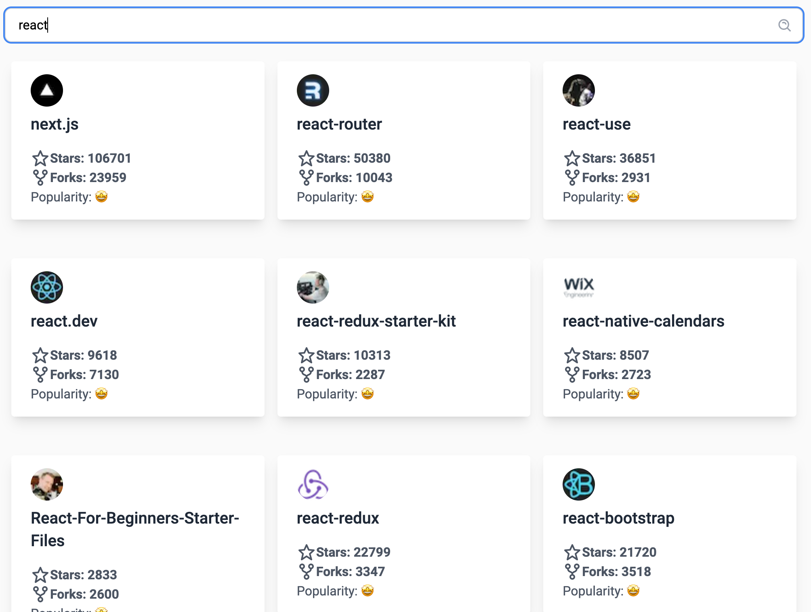

Click here to see the [DEMO]()!

## Description

Technologies used to build this project:

-   [Next.js](https://nextjs.org/) - as a base framework to build the app.
-   [Zustand](https://github.com/pmndrs/zustand) - as state manager, because it is lighter and has less boilerplate code than Redux.
    P.S. Just a quick note, I want to clarify that my use of Zustand does not imply any lack of proficiency in working with Redux. Just wanted to make that clear 😉
-   [React Testing Library](https://testing-library.com/) - to write Unit tests.
-   [Cypress](https://www.cypress.io/) - to write E2E tests.
-   [Prettier](https://prettier.io/) - For code formatting.
-   [Typescript](https://www.typescriptlang.org/) - To have types in JS.
-   [Storybook](https://storybook.js.org/) - Storybook is a front-end workshop for building UI components.

## Getting Started

First, install all dependencies:

```bash
npm install
# or
yarn
```

Then, run the development server:

```bash
npm run dev
# or
yarn dev
```

Open [http://localhost:3000](http://localhost:3000) with your browser to see the result.

## Testing

#### To run Unit tests

```bash
npm run test
# or
yarn test
```

#### To run E2E tests

First, the project needs to be started:

```bash
npm run dev
# or
yarn dev
```

Then we can run the E2E tests:

```bash
npm run cypress
# or
yarn cypress
```

## Storybook

To start the Storybook, run this command:

```bash
npm run storybook
# or
yarn storybook
```
